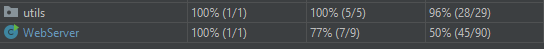
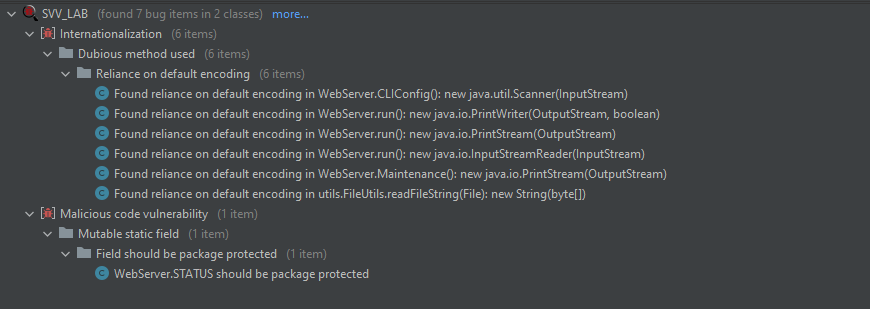
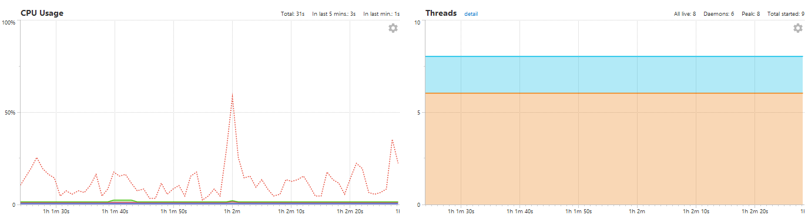
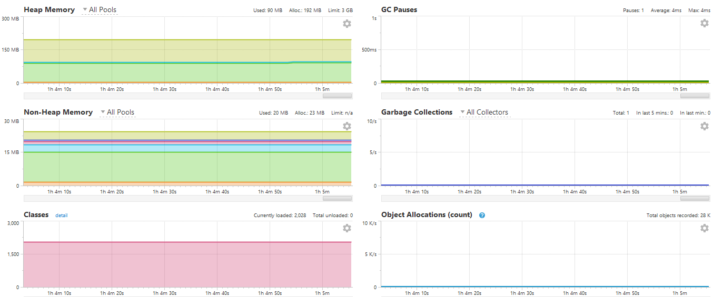
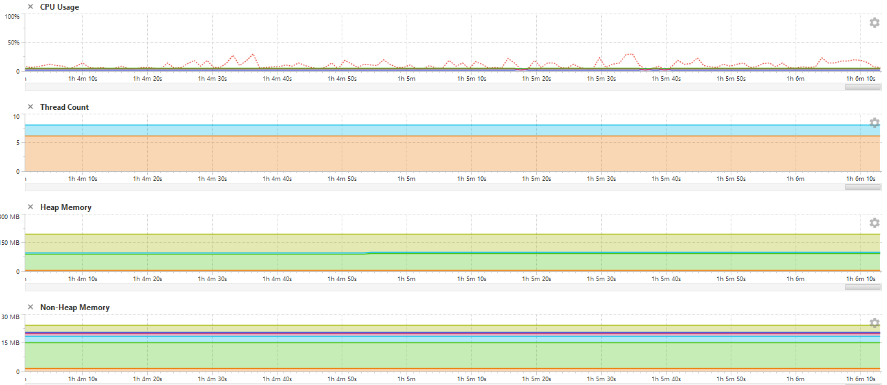

# Software-Verification-Lab
Project for the SVV lab

# [ Section 1: plugins and dependencies ]
* Java 11.0.10
* Dependencies from maven:
  * junit 4.13.2
  * mochito 2.1.0
  * spotbugs RELEASE
* Plugins:
  * spotbugs 1.2.5

# [ Section 2: coverage ]

# [ Section 3: Static analysis ]

# [ Section 4: Dynamic analysis ]

